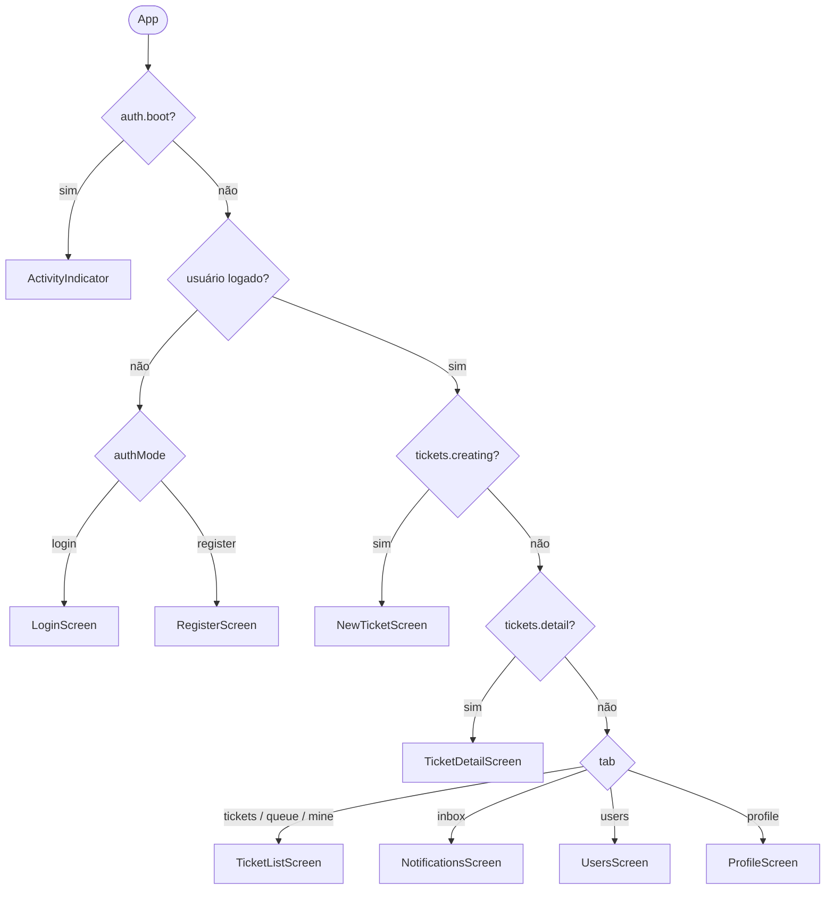
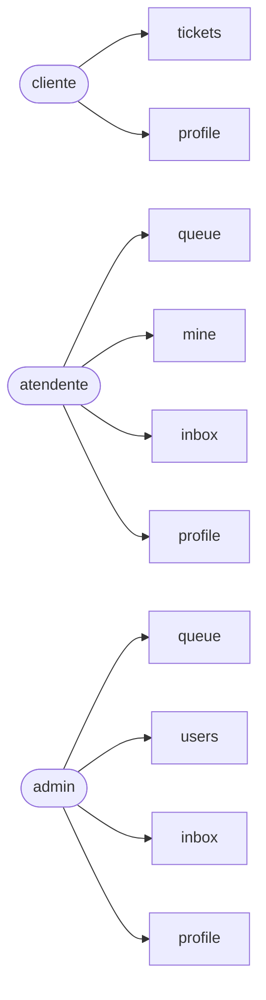
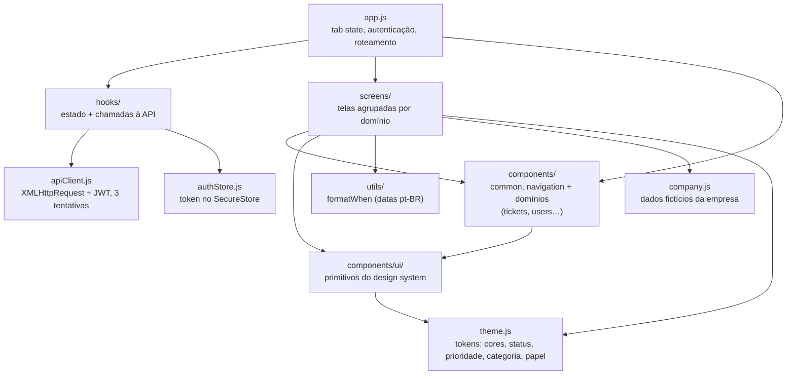
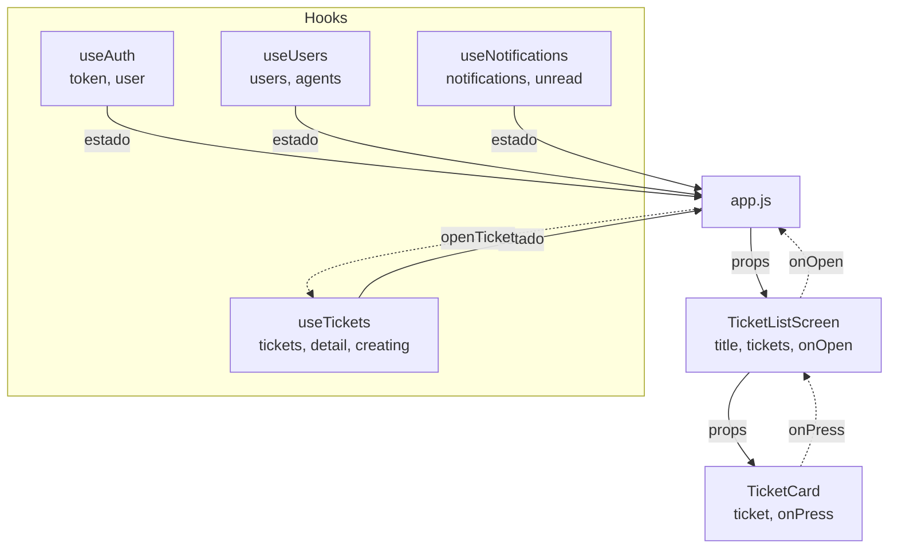
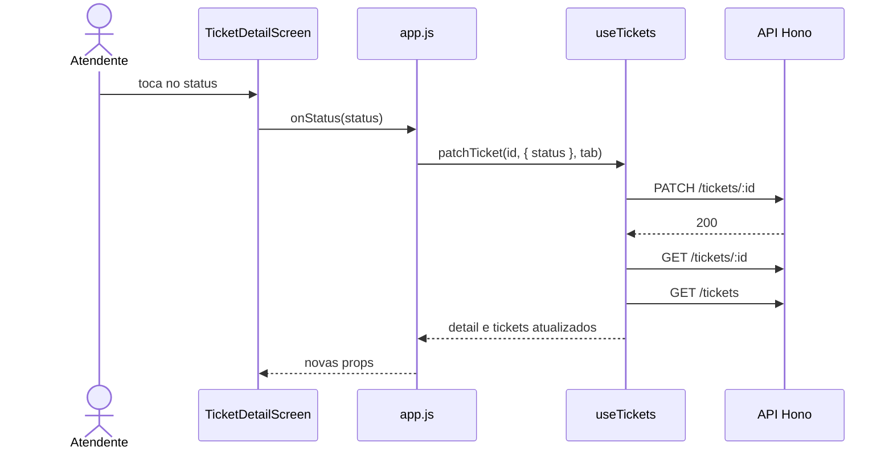
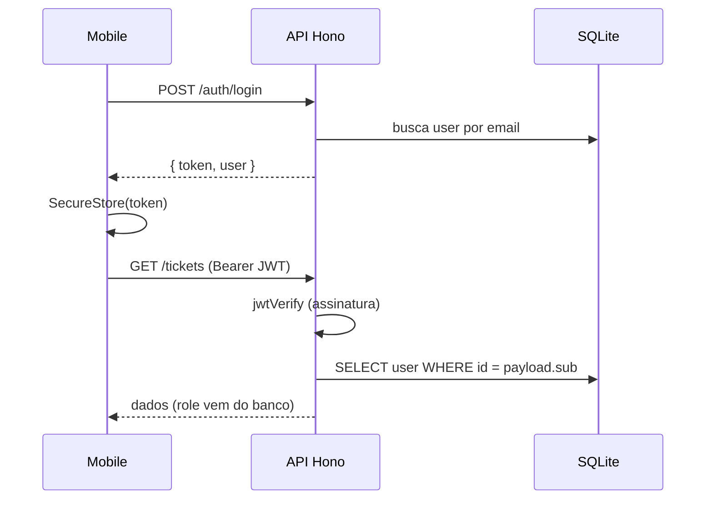

# Aether Desk

Help desk com versões **cliente**, **atendente** e **admin**. Mobile em Expo SDK 57 (React Native 0.86), API em Hono, framework de js bem simples.

Empresa fictícia com placeholders em `mobile/company.js` e `api/src/company.js` (`{{CNPJ}}`, `{{RAZAO_SOCIAL}}`, etc.). Ainda, não fizemos o preenchimento.

---

## Arquitetura

### Organização das pastas e arquivos

```
aether-desk/
  api/                 backend Hono + SQLite
    src/
      app.js           monta a API (CORS, rotas)
      server.js        sobe o servidor local
      auth.js          JWT (sign / verify)
      password.js      hash / verify de senha (PBKDF2)
      http.js          withUser, requireRoles, helpers
      db.js            conexão SQLite + migrate + mappers
      seed.js          usuários e dados demo
      company.js       dados fictícios da empresa
      routes/
        users.js       /auth e /users
        tickets.js     /tickets e /notifications
  mobile/              app Expo (cliente, atendente, admin)
    app.js             tab state, autenticação, roteamento
    index.js           entry do Expo
    apiClient.js       HTTP + JWT (retries)
    authStore.js       token no SecureStore
    company.js         dados fictícios da empresa
    theme.js           tokens: cores, status, prioridade, papel
    hooks/             estado + chamadas à API por domínio
    screens/           telas agrupadas por domínio
    components/        barrel index.js
      ui/              primitivos do design system (Screen, Button, Chip…)
      common/          compostos genéricos: layout, formulário, links (BackLink, FormScroll…)
      navigation/      TabBar
      tickets/         lista e detalhe de chamados (TicketCard…)
      users/           CRUD de usuários (UserCard, NewUserForm)
      profile/         perfil e dados da empresa
      notifications/   item da fila ao vivo
    utils/             helpers (ex.: formatWhen)
    assets/            logo.png (login e perfil)
```

`hooks/`, `screens/` e `utils/` têm `index.js` (barrel). `components/index.js` reexporta `ui/`, `common/`, `navigation/` e as subpastas por domínio — nas telas e no `app.js` use `from "../components"`. Dentro de `components/`, importe os primitivos de `../ui`.

### Roteamento manual

O projeto **deliberadamente não usa React Navigation**. O roteamento é feito com `useState` no `app.js` — cada valor de `tab` mapeia para um componente React. Isso deixa claro o conceito de "estado controla a UI".



As abas disponíveis dependem do papel do usuário (`tabsFor` no `app.js`). A `TabBar` some enquanto um chamado está sendo criado ou aberto.



### Módulos



### Fluxo de dados (Props)



Exemplo de uma ação subindo e o estado descendo — atendente muda o status de um chamado:



**Padrão:** Dados descem, ações sobem. A tela não faz fetch — o hook faz. A tela não muta estado — chama callback que o hook expõe.

---

## Design system em camadas

| Camada | Onde | O que guarda | Pode importar |
|---|---|---|---|
| Tokens | `theme.js` | Só valores: cores, status, prioridade, papel | nada |
| Primitivos | `components/ui/` | Blocos visuais genéricos, sem regra de negócio | `theme.js` |
| Compostos | `components/common/`, `navigation/` e domínios | Peças montadas com os primitivos | `ui/`, `theme.js`, `utils/` |
| Telas | `screens/` | Composição da tela, recebe estado por props | `components/`, `theme.js`, `utils/`, `company.js` |

Regra: `ui/` não importa nada do resto de `components/`. Se um componente precisa conhecer chamado, usuário ou empresa, ele é composto, não primitivo.

### Primitivos (`components/ui/`)

Um arquivo por primitivo, reexportados por `components/ui/index.js`. Cada um é uma função que retorna JSX com estilos consistentes, usando as cores de `theme.js`.

| Componente | O que faz | Por quê |
|---|---|---|
| `Screen` | Wrapper de todas as telas. `KeyboardAvoidingView` (padding no iOS) + padding por plataforma | Evita que teclado cubra inputs no iOS |
| `Card` | Container branco com borda, cantos arredondados e sombra sutil | Agrupa visualmente informações relacionadas |
| `Title` | Texto grande (28px, peso 800) | Cabeçalho de cada tela |
| `Muted` | Texto menor (14px, cinza) | Descrições e textos secundários |
| `Badge` | Pílula colorida (fundo + texto) | Indica estado de forma compacta |
| `Field` | Label + `TextInput` estilizado, com `secure` e `multiline` | Todo formulário precisa de input |
| `Button` | Botão com 3 variantes (primary, ghost, danger) e estado `loading` | Ações principais, secundárias e destrutivas |
| `Chip` | Pílula clicável (selecionado/não selecionado) | Seleção visual de prioridade, status, papel e atendente |
| `SectionTitle` | Texto em negrito com espaço abaixo | Título de seção dentro de um card |
| `ErrorText` | Texto vermelho, só renderiza com mensagem | Erro de formulário |
| `inputBox` | Objeto de estilo (fundo, borda, raio) | Visual comum entre `Field` e `PickerField` |

### Componentes compostos (`components/`)

Import único via `components/index.js`. Subpastas por domínio; o que é transversal fica em `common/`.

| Pasta | Componentes | Papel |
|---|---|---|
| `common/` | `BackLink`, `TextLink`, `ChipGroup`, `EmptyState`, `FormScroll`, `ScreenHeader`, `Logo`, `EmailField`, `PasswordField`, `PickerField`, `SwitchRow`, `InfoRow` | Layout, auth, formulários e feedback |
| `navigation/` | `TabBar` | Barra inferior com abas + badge de contagem, usada só no `app.js` |
| `tickets/` | `TicketCard`, `TicketPeople`, `AssignAgent`, `TicketHistory`, `SatisfactionRating` | Lista, detalhe e ações do chamado |
| `users/` | `UserCard`, `NewUserForm` | Administração de usuários |
| `profile/` | `UserSummary`, `CompanyCard` | Conta e dados fictícios da empresa |
| `notifications/` | `NotificationItem` | Linha da fila ao vivo |

---

## Telas (`screens/`)

As telas ficam agrupadas por domínio, e `screens/index.js` reexporta todas:

| Arquivo | Exporta |
|---|---|
| `auth.js` | `LoginScreen`, `RegisterScreen` |
| `tickets.js` | `TicketListScreen`, `NewTicketScreen`, `TicketDetailScreen` |
| `notifications.js` | `NotificationsScreen` |
| `profile.js` | `ProfileScreen` |
| `users.js` | `UsersScreen` |

| Tela | Componentes usados | Estado local | Descrição |
|---|---|---|---|
| `LoginScreen` | Screen, FormScroll, Logo, ScreenHeader, Card, EmailField, PasswordField, Button, ErrorText | useState (email, password) | Login, já preenchido com a conta de cliente demo |
| `RegisterScreen` | Screen, FormScroll, BackLink, ScreenHeader, Card, Field, EmailField, PasswordField, Button, ErrorText | useState (name, email, password) | Cadastro de cliente |
| `TicketListScreen` | Screen, ScreenHeader, Button, FlatList, TicketCard, EmptyState | — | Lista de chamados: "Meus chamados" (cliente), "Fila" e "Comigo" (equipe). Só o cliente vê "Novo chamado" |
| `NewTicketScreen` | Screen, BackLink, ScreenHeader, ScrollView, Card, Field, ChipGroup, PickerField, Button | useState (title, description, priority, category) | Abertura de chamado |
| `TicketDetailScreen` | Screen, BackLink, ScrollView, Badge, Title, Muted, TicketPeople, AssignAgent, ChipGroup, SatisfactionRating, TicketHistory, Button | — | Detalhe e histórico. Equipe atribui atendente e muda status; cliente cancela chamado aberto; admin exclui; cliente avalia chamado resolvido (1–5, só local, não vai para a API) |
| `NotificationsScreen` | Screen, ScreenHeader, TextLink, FlatList, NotificationItem, EmptyState | — | "Fila ao vivo" da equipe, alimentada pelo polling do `useNotifications`. "Limpar" zera a lista |
| `ProfileScreen` | Screen, ScreenHeader, UserSummary, CompanyCard, SwitchRow, Button | useState (notifyEnabled) | Perfil do usuário + dados da empresa. O Switch de notificações é só local. Sair pede confirmação com `Alert` |
| `UsersScreen` | Screen, ScreenHeader, NewUserForm, FlatList, UserCard | — | CRUD de usuários (só admin): criar, mudar papel, ativar/desativar, remover |

---

## Hooks customizados (`hooks/`)

| Hook | Estado | Funções |
|---|---|---|
| `useAuth()` | token, user, boot, authError, authLoading | login(), register(), logout(), setAuthError() |
| `useTickets(token)` | tickets, detail, creating, saving | refreshTickets(), openTicket(), createTicket(), patchTicket(), deleteTicket(), clearDetail(), startCreating(), cancelCreating() |
| `useUsers(token, isStaff)` | users, agents | refreshUsers(), createUser(), toggleUser(), changeRole(), deleteUser() |
| `useNotifications(token, isStaff, onRefreshTickets)` | notifications, unread | openNotification(), markSeen(), clearNotifications() |

- `useAuth` restaura o token salvo no boot e valida com `GET /auth/me`; se falhar, apaga o token.
- `useTickets.refreshTickets(tab)` chama `GET /tickets`, com `?mine=1` na aba `mine`. Quem filtra por cliente é a API.
- `useUsers` só busca quando o usuário é da equipe. `agents` são os usuários com papel atendente ou admin.
- `useNotifications` faz polling de `GET /notifications?since=…` a cada 8s, só para a equipe, e chama `onRefreshTickets` quando chega algo novo.

---

## Componentes nativos e bibliotecas

| Componente | De onde vem | Onde |
|---|---|---|
| `View`, `Text` | `react-native` | Todos os componentes e telas |
| `Image` | `react-native` | Via `Logo` e `UserSummary` (`mobile/assets/logo.png`) |
| `TextInput` | `react-native` | Via `Field` (`components/ui`) |
| `Pressable` | `react-native` | Button, Chip, TabBar, TextLink, TicketCard, NotificationItem |
| `ScrollView` | `react-native` | FormScroll, NewTicket, TicketDetail |
| `FlatList` | `react-native` | TicketListScreen, NotificationsScreen, UsersScreen |
| `Switch` | `react-native` | Via `SwitchRow` no ProfileScreen |
| `Slider` | `@react-native-community/slider` | Via `SatisfactionRating` no detalhe do chamado |
| `ActivityIndicator` | `react-native` | Boot do app + `Button` em loading |
| `KeyboardAvoidingView` | `react-native` | Via `Screen` (`components/ui`) |
| `Alert` | `react-native` | ProfileScreen (confirmação de saída) |
| `Picker` | `@react-native-picker/picker` | Via `PickerField` em NewTicketScreen |
| `SecureStore` | `expo-secure-store` | authStore.js (token JWT) |
| `StatusBar` | `expo-status-bar` | app.js |

---

## API (`api/`)

- Hono com rotas `/health`, `/auth`, `/users`, `/tickets` e `/notifications`.
- Banco SQLite nativo do Node (`node:sqlite`, exige Node 22.5+). Localmente fica em `api/data/aether.db`; `DATABASE_URL=file:...` troca o caminho.
- Na Vercel o banco é **em memória**: os dados somem quando a function reinicia. Os usuários demo são recriados toda vez que a API sobe.
- Senhas com PBKDF2-SHA256 (`node:crypto`), JWT com `jose`.

### Autenticação

Fluxo JWT Bearer (sem cookies, sem refresh, sem logout no servidor):

1. Login/registro → `POST /auth/login` ou `/auth/register`
2. API valida a senha e assina um JWT HS256 (12h) com `sub`, `role`, `name`, `email`
3. App guarda o token no SecureStore (`aether.token`)
4. Cada request manda `Authorization: Bearer …`
5. Handlers usam `withUser` / `requireRoles` (não há middleware global)
6. Logout no mobile só apaga o token local — o JWT segue válido até expirar



#### Por que não dá para forjar outra role?

O JWT carrega uma claim `role`, mas a API **não usa essa claim para autorizar**. Em `withUser`, o token só entrega o `sub` (id do usuário). A role vem do banco:

```js
const payload = await readToken(token);
const result = await db.execute({
  sql: "SELECT * FROM users WHERE id = ? LIMIT 1",
  args: [payload.sub],
});
const user = mapUser(result.rows[0]);
```

`requireRoles` olha `user.role` desse registro — não `payload.role`.

Se alguém alterar o JWT na mão:

1. **Sem o `JWT_SECRET`**, qualquer mudança no payload quebra a assinatura HS256 → `jwtVerify` falha → 401.
2. **Mesmo com um JWT válido**, a claim `role` no token é só informativa; a autorização sempre reconsulta o usuário no DB.

Forjar `role: "admin"` no token não muda nada — ou a assinatura invalida o token, ou a role real continua sendo a do banco.

---

## Como rodar

Sem `EXPO_PUBLIC_API_URL`, o app usa a API de produção (`https://react-native-apps.vercel.app`). No **iPhone**, `localhost` é o próprio aparelho: para usar a API local, aponte `EXPO_PUBLIC_API_URL` para o IP da máquina na mesma rede. O `npm start` sobe o Metro com túnel (`expo start --tunnel`) para o Expo Go carregar o JS.

```bash
cd mobile
npm install
npm start
```

Backend local (opcional):

```bash
cd api
npm install
npm run seed
npm run dev
```

```bash
cd mobile
EXPO_PUBLIC_API_URL=http://localhost:3001 npx expo start --lan
```

## Contas de demo

| Papel | Email | Senha |
|---|---|---|
| Cliente | `cliente@aether.desk` | `Cliente#123` |
| Atendente | `agente@aether.desk` | `Agente#123` |
| Admin | `admin@aether.desk` | `Admin#123` |

## Layout do projeto

```
aether-desk/
  api/       backend Hono + node:sqlite (Vercel)
  mobile/    Expo (cliente, atendente, admin)
             assets/logo.png · components/{ui,common,navigation,tickets,users,profile,notifications}
```

Na Vercel: publique o subdiretório `api` como projeto da API (`api/vercel.json` manda tudo para a function `api/index.js`) e `mobile` como front (`mobile/vercel.json` roda `npx expo export --platform web` e publica `dist`).

Arquitetura para slides: `leo-vault/personal/faculdade/dispositivos-moveis/aether-desk/`.
